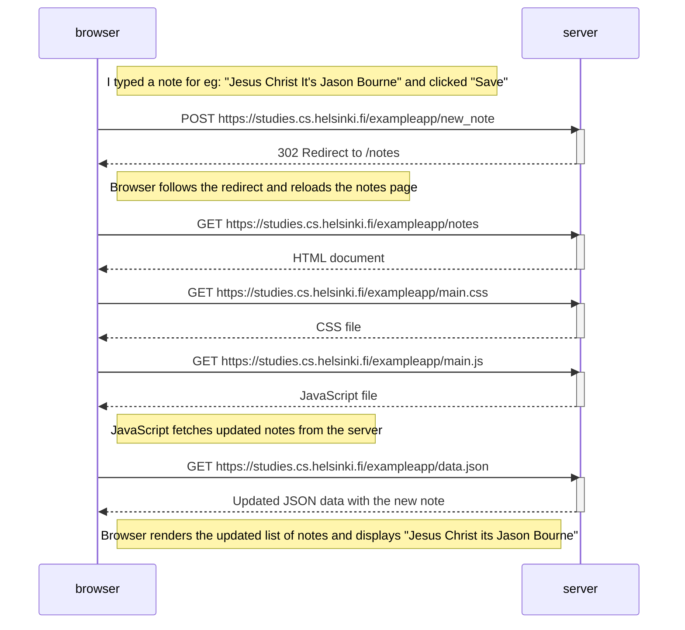

```mermaid
sequenceDiagram
    participant browser
    participant server

    Note right of browser: I typed a note for eg: "Jesus Christ It's Jason Bourne" and clicked "Save"

    browser->>server: POST https://studies.cs.helsinki.fi/exampleapp/new_note
    activate server
    server-->>browser: 302 Redirect to /notes
    deactivate server

    Note right of browser: Browser follows the redirect and reloads the notes page

    browser->>server: GET https://studies.cs.helsinki.fi/exampleapp/notes
    activate server
    server-->>browser: HTML document
    deactivate server

    browser->>server: GET https://studies.cs.helsinki.fi/exampleapp/main.css
    activate server
    server-->>browser: CSS file
    deactivate server

    browser->>server: GET https://studies.cs.helsinki.fi/exampleapp/main.js
    activate server
    server-->>browser: JavaScript file
    deactivate server

    Note right of browser: JavaScript fetches updated notes from the server

    browser->>server: GET https://studies.cs.helsinki.fi/exampleapp/data.json
    activate server
    server-->>browser: Updated JSON data with the new note
    deactivate server

    Note right of browser: Browser renders the updated list of notes and displays "Jesus Christ its Jason Bourne"
```