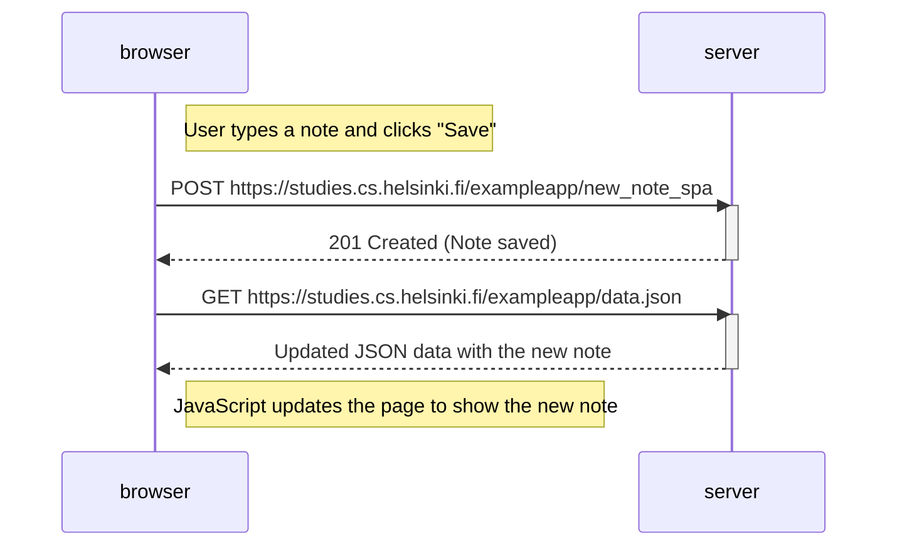

```mermaid
sequenceDiagram
    participant browser
    participant server

    Note right of browser: User types a note and clicks "Save"

    browser->>server: POST https://studies.cs.helsinki.fi/exampleapp/new_note_spa
    activate server
    server-->>browser: 201 Created (Note saved)
    deactivate server

    browser->>server: GET https://studies.cs.helsinki.fi/exampleapp/data.json
    activate server
    server-->>browser: Updated JSON data with the new note
    deactivate server

    Note right of browser: JavaScript updates the page to show the new note
```